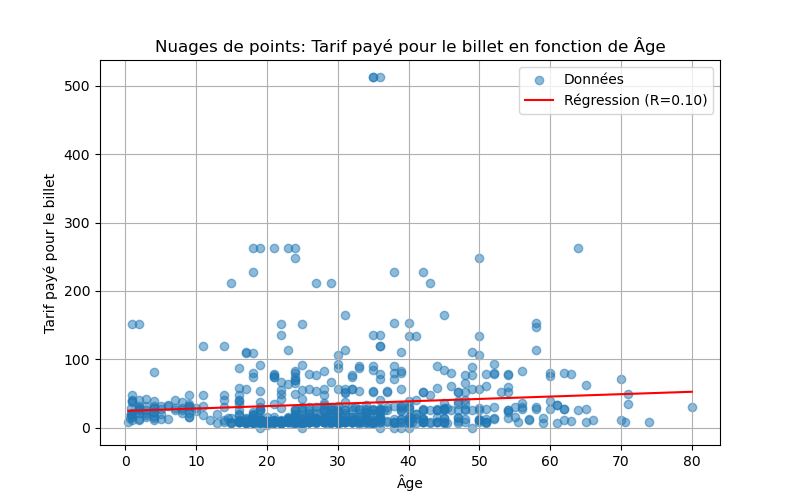

# Titanic Survival Analysis & Statistical Modeling - by Xuan Anh (Lucy) Hoang and Saad Larabi
An end-to-end analysis of Titanic Survival Analysis from data cleaning to analysis and visualization.

## Project Overview:
This project provides an end-to-end data analysis of the Titanic passenger manifest. The goal is to explore the factors that influenced survival rates through data cleaning, feature engineering, and statistical modeling. Unlike standard exploratory notebooks, this project is built with a modular architecture, separating core logic into a reusable Python library to ensure scalability and maintainability.

## Tech Stack:
- Language: Python
- Data Manipulation: Pandas (cleaning, filtering, and renaming complex datasets), NumPy (numerical operations).
- Statistical Analysis: SciPy (specifically stats for linear regression and correlation coefficients).
- Visualization: Matplotlib (generating distribution plots, bar charts for survival rates, and regression lines).
- Environment: Jupyter Notebooks and Python Scripts.

## Key Insights: 
- Socio-Economic Influence: A clear correlation was identified between passenger class and survival probability. The analysis shows that "First Class" passengers had a significantly higher survival rate compared to "Third Class."
- Demographic Factors: The data confirms the "women and children first" protocol, with female passengers and children showing drastically higher survival counts across all embarkation points.
- Statistical Correlation: Using linear regression, the project quantifies the relationship between specific variables (like Fare and Age) and survival, providing an R-value to indicate the strength of these connections.
- Geographic Trends: The visualization of survival by embark town reveals that passengers embarking from Cherbourg had different survival distributions compared to those from Southampton or Queenstown.

## Project Structure:
### 1. Dataset
- [Raw Dataset](41_Titanic2.csv)
- [Processed Dataset](TITANIC_2025-05-10_14-22.csv)

### 2. Notebook
- [Main analysis Notebook](TITANIC.ipynb)
- [Modular functions](fonctions.py)

### 3. Exports
- [Visualization: Linear regression plot](regression.png)
- [Descriptive statistics export](statistiques.csv)

## Sample Visualization

Linear Regression Analysis: Age vs. Fare
- This visualization explores the correlation between passenger age and the fare paid. The red regression line and the calculated R-value provide a statistical measure of the relationship strength, helping to identify spending patterns across different age demographics.

